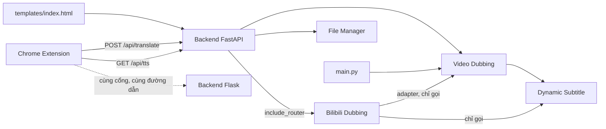

# LIFE_OS — Trang chủ

Vault này là **nguồn sự thật duy nhất** của dự án: luật, trạng thái, kiến trúc, quy ước, quyết định, việc treo. Các file `AGENTS.md`, `CLAUDE.md`, `PROJECT_STATUS.md`, `ARCHITECTURE.md` ở thư mục gốc chỉ còn là bảng chỉ đường trỏ vào đây.

> AI mới vào dự án: đọc [[Bắt đầu ở đây]] trước khi làm bất cứ việc gì.

## Cho AI
| Ghi chú | Trả lời câu hỏi |
| --- | --- |
| [[Bắt đầu ở đây]] | Luật cứng và thứ tự đọc |
| [[Phạm vi và quyền]] | Tôi được sửa gì, cấm sửa gì |
| [[Quy trình làm việc]] | Trước, trong và sau một nhiệm vụ phải làm gì |
| [[Tóm tắt dán tay]] | Bản gọn để dán vào ChatGPT hoặc AI không đọc được file |

## Quy ước
[[Quy ước code]] · [[Thêm module mới]] · [[Quy ước git]] · [[Quy ước vault]] · [[Định nghĩa xong]]

## Dự án
| Ghi chú | Nội dung |
| --- | --- |
| [[Trạng thái]] | Module nào Stable, cái gì đang làm |
| [[Việc cần làm]] | Roadmap và việc treo |
| [[Kiến trúc]] | Các khối, cây thư mục, luồng dữ liệu |
| [[API]] | Mọi endpoint và hợp đồng JSON |
| [[Môi trường và chạy]] | Cài đặt, lệnh chạy, lệnh test |
| [[Change log]] | Lịch sử thay đổi |
| [[Nhật ký quyết định]] | Vì sao làm thế này |
| [[Vấn đề đã biết]] | Lỗi và giới hạn |
| [[Phát hiện - liên hệ ẩn]] | Chỗ các phần chạm nhau mà dễ bỏ sót |

## Module
| Ghi chú | Trạng thái | Vai trò |
| --- | --- | --- |
| [[Backend FastAPI]] | đang dùng | `app.py`, cổng 8000 |
| [[Backend Flask]] | đang dùng, sẽ gộp | `vi_sub_server.py`, phục vụ extension |
| [[Video Dubbing]] | Stable | pipeline lồng tiếng gốc |
| [[Dynamic Subtitle]] | Stable | Whisper bóc băng, phụ đề ASS |
| [[File Manager]] | Stable | CRUD file trong `core/input/` |
| [[Chrome Extension]] | Stable | dịch và đọc phụ đề trên trang web |
| [[Bilibili Dubbing]] | chờ xác nhận | tải, dịch, duyệt, lồng tiếng, thư viện |

## Ai gọi ai

## Nhật ký phiên
- [[2026-10-06]]
- [[2026-10-05]]
